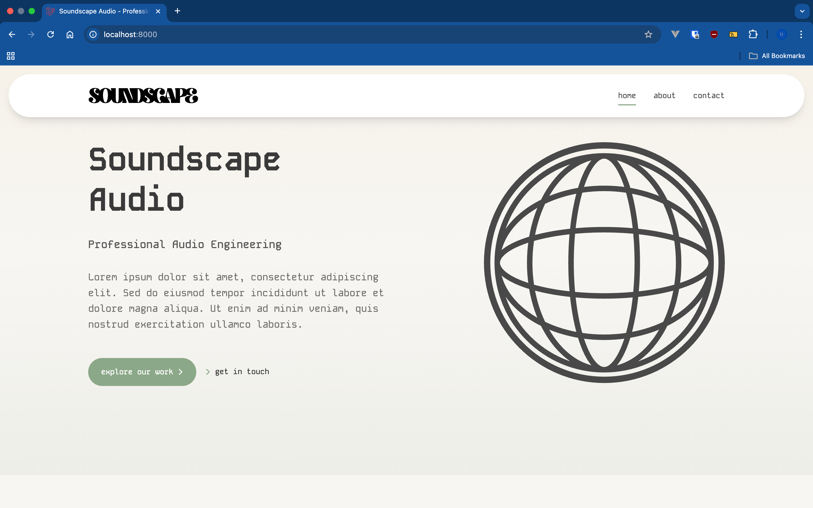
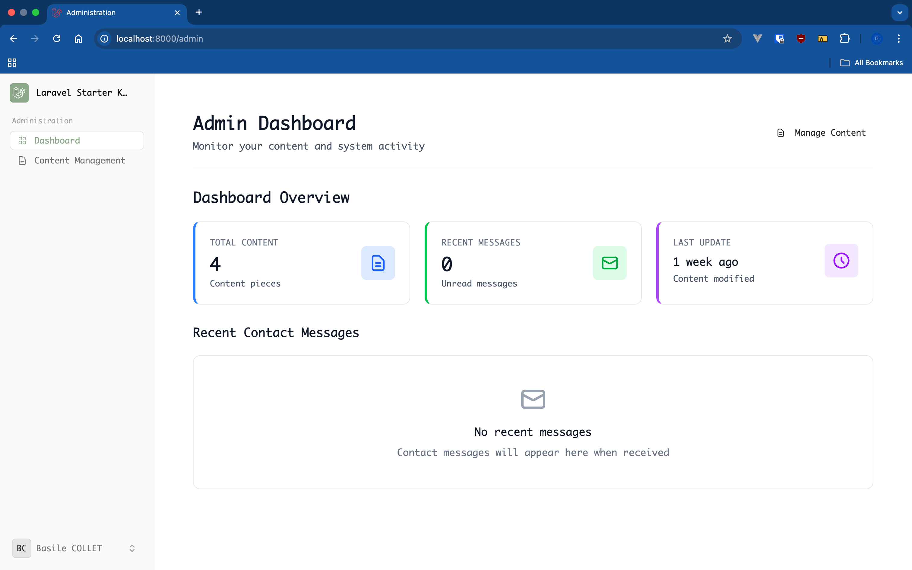

# 🎵 Soundscape Audio

A modern portfolio platform for a sound engineer, built with Laravel 12. Features a comprehensive portfolio showcase, admin dashboard, and content management system. Built with Domain-Driven Design architecture and extensive testing coverage.


## 📋 Table of Contents

- [Features](#-features)
- [Tech Stack](#-tech-stack)
- [Prerequisites](#-prerequisites)
- [Installation](#-installation)
- [Development](#-development)
- [Localization](#-localization)
- [Project Structure](#-project-structure)
- [Testing](#-testing)
- [Deployment](#-deployment)
- [License](#-license)

## ✨ Features

### Current Features (Portfolio Foundation)
- 📈 **Admin Dashboard** - Comprehensive admin interface with statistics and content management
- 📝 **Content Management System** - Dynamic page content with real-time editing
- 📬 **Contact System** - Contact form with GDPR compliance and message management
- 🏠 **Portfolio Website** - Modern portfolio with Home, About, Project and Contact pages
- 🔐 **Authentication System** - Complete auth with registration, login, password reset
- 👤 **User Settings** - Profile management, password change, appearance settings
- 🌍 **Localization** - Full EN/FR translations with proper fallback support
- 🎨 **Modern UI** - Flux UI components with Tailwind CSS 4
- 📊 **Testing Coverage** - Comprehensive Pest PHP tests with high coverage
- 🔍 **Code Quality** - PHPStan level 9 analysis and Laravel Pint formatting
- 🏢 **DDD Architecture** - Domain-Driven Design with Application/Domain/Infrastructure layers
- 🐳 **Docker Development** - Optimized multi-stage containerized environment

### Application Areas
- **Sound Engineer Portfolio** - Showcase of audio projects, skills, and experience
- **Admin Dashboard** - Project management, content management, and message tracking
- **GDPR Tools** - Data export, deletion, and consent management

## 🛠 Tech Stack

### Backend
- **Laravel 12** - Latest PHP framework
- **PHP 8.4** - With OPcache and Xdebug
- **Livewire** - Single-file reactive components
- **PostgreSQL 15** - Primary database (Docker)
- **Domain-Driven Design** - Clean architecture with Application/Domain/Infra layers
- **Repository Pattern** - Database abstraction with interfaces

### Frontend
- **Tailwind CSS 4** - Utility-first CSS framework
- **Flux UI** - Component library
- **Alpine.js** - Lightweight JavaScript framework
- **Vite** - Fast build tool with HMR

### Infrastructure & Quality
- **Docker** - Multi-stage containerized development with health checks
- **Nginx** - Optimized web server configuration
- **Make** - 40+ automated tasks and workflows
- **Pest PHP** - Comprehensive testing framework
- **PHPStan** - Static analysis (level 9)
- **Laravel Pint** - Code formatting and style
- **Coverage Reports** - HTML test coverage generation

## 📦 Prerequisites

### For Docker Development (Recommended)
- Docker Desktop 20.10+ or Docker Engine with Docker Compose
- Make (optional but recommended)
- 4GB RAM minimum for Docker
- 10GB free disk space

### For Local Development (Alternative)
- PHP 8.4+
- Composer 2.0+
- Node.js 20+ and NPM/Yarn
- PostgreSQL 15+ / SQLite

## 🚀 Installation

### Option 1: Quick Start with Docker (Recommended)

```bash
# Clone the repository
git clone https://github.com/yourusername/soundscape.git
cd soundscape

# Make initialization script executable
chmod +x docker/init-dev.sh

# Run automated setup (installs everything)
make init

# Start development server
make dev
```

That's it! The application will be available at:
- 🌐 **Application**: http://localhost:8000
- ⚡ **Vite Dev Server**: http://localhost:5173
- 🗄️ **Database**: localhost:5432

### Option 2: Manual Docker Setup

```bash
# Clone the repository
git clone https://github.com/yourusername/soundscape.git
cd soundscape

# Copy environment file
cp .env.docker .env

# Build and start containers
docker-compose up -d

# Install dependencies
make composer-install
make yarn-install

# Generate application key
docker-compose exec app php artisan key:generate

# Run migrations and seeders
make fresh

# Start Vite dev server
make vite
```

### Option 3: Local Development (Without Docker)

```bash
# Clone the repository
git clone https://github.com/yourusername/soundscape.git
cd soundscape

# Install PHP dependencies
composer install

# Copy environment file and configure
cp .env.example .env

# Generate application key
php artisan key:generate

# Configure your database in .env file
# DB_CONNECTION=sqlite (or pgsql/mysql)

# Run migrations and seeders
php artisan migrate --seed

# Install Node dependencies
npm install

# Start development servers
# Terminal 1:
php artisan serve

# Terminal 2:
npm run dev
```

## 💻 Development

### Daily Workflow

```bash
# Start your day
make up        # Start Docker containers
make vite      # Start Vite dev server (in another terminal)

# During development
make artisan cmd="make:model Product -m"  # Create models
make migrate                               # Run migrations
make test                                  # Run tests
make pint                                  # Format code

# End of day
make down      # Stop containers
```

### Available Make Commands

Run `make help` to see all 40+ available commands. Key commands:

#### Development
| Command | Description |
|---------|-------------|
| `make init` | Complete project initialization |
| `make dev` | Start development environment with Vite |
| `make up/down` | Start/stop Docker containers |
| `make shell` | Access PHP container shell |
| `make shell-node` | Access Node container shell |
| `make logs` | View container logs |

#### Laravel & Database
| Command | Description |
|---------|-------------|
| `make artisan cmd="..."` | Run any artisan command |
| `make migrate` | Run database migrations |
| `make fresh` | Fresh migration with seeding |
| `make seed` | Seed the database |
| `make tinker` | Start Laravel Tinker |

#### Testing & Quality
| Command | Description |
|---------|-------------|
| `make test` | Run all tests |
| `make test-coverage` | Run tests with HTML coverage |
| `make test-unit` | Run unit tests only |
| `make test-feature` | Run feature tests only |
| `make tdd` | Start TDD watch mode |
| `make pint` | Format PHP code |
| `make phpstan` | Run static analysis |
| `make quality` | Run all quality tools |

#### Frontend
| Command | Description |
|---------|-------------|
| `make vite` | Start Vite dev server |
| `make vite-build` | Build for production |
| `make yarn cmd="..."` | Run yarn commands |

### Code Style

The project uses Laravel Pint for PHP code formatting:

```bash
# Format code
make pint

# Check without fixing
make pint-test
```

## 🌍 Localization

The application supports full localization with English and French translations.

### Available Languages
- 🇫🇷 **French (FR)** - Default language (primary audience)
- 🇬🇧 **English (EN)** - Full translations available

### Translation Files Structure

```
lang/
├── en/                 # English translations
│   ├── admin.php      # Admin interface (398 lines)
│   ├── portfolio.php  # Portfolio interface (85 lines)
│   ├── ui.php         # Common UI elements (213 lines)
│   ├── domain.php     # Domain validations (53 lines)
│   ├── auth.php       # Laravel auth
│   ├── validation.php # Laravel validation
│   └── passwords.php  # Password reset
└── fr/                # French translations (same structure)
```

### Changing the Application Language

Update your `.env` file:

```env
# French (default)
APP_LOCALE=fr
APP_FALLBACK_LOCALE=en

# English
APP_LOCALE=en
APP_FALLBACK_LOCALE=fr
```

### Translation Key Organization

**Admin Interface** (`lang/*/admin.php`):
- `admin.navigation.*` - Admin navigation items
- `admin.dashboard.*` - Dashboard statistics and widgets
- `admin.projects.*` - Project management interface
- `admin.content.*` - Content management system
- `admin.settings.*` - Application settings

**Portfolio Interface** (`lang/*/portfolio.php`):
- `portfolio.home.*` - Homepage sections
- `portfolio.about.*` - About page content
- `portfolio.projects.*` - Projects showcase
- `portfolio.contact.*` - Contact form
- `portfolio.navigation.*` - Public navigation

**Common UI** (`lang/*/ui.php`):
- `ui.common.*` - Common actions (save, cancel, delete, etc.)
- `ui.status.*` - Status labels (draft, published, archived)
- `ui.empty_states.*` - Empty state messages
- `ui.errors.*` - Generic error messages
- `ui.settings.*` - User settings interface

**Domain Validations** (`lang/*/domain.php`):
- `domain.project.*` - Project entity validations
- `domain.project.title.*` - Title validations
- `domain.project.description.*` - Description validations
- `domain.project.slug.*` - Slug validations

### Using Translations in Code

```php
// In Blade templates
{{ __('admin.projects.create') }}
{{ __('domain.project.cannot_publish_invalid_status', ['status' => $status]) }}

// In PHP code
__('ui.messages.saved')
session()->flash('success', __('admin.projects.created_successfully'));

// In Livewire components
$this->addError('title', __('domain.project.title.empty'));
```

### Domain Exception Architecture

The application uses **separated, single-responsibility exceptions** following DDD principles:

```php
// Publishing a project can throw TWO distinct exceptions:

// 1. Invalid status (not a draft)
throw ProjectCannotBePublishedException::invalidStatus($status);

// 2. Missing required data (no description)
throw ProjectMissingRequiredDataException::missingDescription();
```

**Exception Handling Pattern**:
```php
try {
    $project->publish();
} catch (ProjectMissingRequiredDataException $e) {
    // Handle missing description specifically
    session()->flash('error', __('domain.project.cannot_publish_missing_description'));
} catch (ProjectCannotBePublishedException $e) {
    // Handle invalid status
    session()->flash('error', __('domain.project.cannot_publish_invalid_status', [
        'status' => $e->getStatus()->value
    ]));
}
```

**Why Separated Exceptions?**
- ✅ Single Responsibility Principle (SRP)
- ✅ Type safety - no nullable properties
- ✅ Clear intent - exception name describes the exact problem
- ✅ Better error handling - catch specific scenarios
- ✅ DDD-compliant - each exception represents one domain rule violation

**Technical Exception Messages:**
All domain exceptions use the `"Technical: "` prefix for internal logging and debugging, while translations provide user-friendly messages.

## 📁 Project Structure

### Domain-Driven Design Architecture

```
soundscape/
├── app/
│   ├── Application/   # Application services & DTOs
│   │   ├── Admin/    # Admin services (Content, Dashboard)
│   │   └── Portfolio/ # Portfolio services (Contact, Content)
│   ├── Domain/       # Domain logic & contracts
│   │   ├── Admin/    # Admin domain
│   │   │   ├── Entities/      # Domain entities (Project, Image)
│   │   │   ├── Exceptions/    # Domain exceptions (single-responsibility)
│   │   │   ├── ValueObjects/  # Value objects (Title, Slug, Date, etc.)
│   │   │   └── Services/      # Domain services
│   │   └── Portfolio/ # Portfolio domain
│   ├── Infra/        # Infrastructure implementations
│   │   └── Repositories/ # Database repositories
│   ├── Http/         # Controllers by domain
│   │   ├── Admin/    # Admin controllers
│   │   ├── Portfolio/ # Portfolio controllers
│   │   └── Auth/     # Auth controllers
│   ├── Livewire/     # Livewire components
│   │   ├── Admin/    # Admin components
│   │   ├── Components/ # Reusable components
│   │   └── Actions/  # Livewire actions
│   └── Models/       # Eloquent models
├── lang/             # Localization files
│   ├── en/          # English translations (4 files)
│   └── fr/          # French translations (4 files)
├── resources/views/
│   ├── livewire/     # Livewire component views
│   │   ├── admin/    # Admin dashboard views
│   │   ├── auth/     # Authentication views
│   │   └── components/ # Reusable components
│   ├── admin/        # Admin layouts
│   ├── portfolio/    # Portfolio pages
│   └── flux/         # Flux UI overrides
├── tests/            # Comprehensive test suite
│   ├── Feature/      # Feature tests by domain
│   ├── Unit/         # Unit tests for services
│   └── Infra/        # Infrastructure tests
├── docker/           # Optimized Docker configs
├── database/         # Migrations & seeders
├── Makefile          # 40+ automated commands
└── README.md         # This documentation
```

## 🧪 Testing

The project uses Pest PHP for testing:

```bash
# Run all tests
make test

# Run with coverage
make test-coverage

# Run specific test
docker-compose exec app php artisan test tests/Feature/DashboardTest.php
```

### Current Test Coverage
- ✅ **Authentication System** - Complete auth flows and email verification
- ✅ **Admin Dashboard** - Content management, statistics, and admin interface
- ✅ **Contact System** - Contact form, message persistence, and GDPR compliance
- ✅ **User Management** - Profile management, settings, and password changes
- ✅ **Livewire Components** - All portfolio components (Home, About, Contact sections)
- ✅ **Application Services** - Unit tests for all DTOs and application services
- ✅ **Domain Entities & Value Objects** - Complete domain logic testing
- ✅ **Domain Exceptions** - Testing separated exception architecture
- ✅ **Infrastructure** - Repository implementations and database interactions
- ✅ **Controllers** - HTTP controllers for all domains (Admin, Portfolio, Auth)

The project maintains **high test coverage** (589+ passing tests) across all architecture layers with comprehensive Feature, Unit, and Infrastructure tests.

## 🚢 Deployment

### Production with Clever Cloud

The application is configured for deployment on Clever Cloud. Configuration will be added when instances are ready.

### Environment Variables

Key environment variables for production:

```env
APP_ENV=production
APP_DEBUG=false
APP_URL=https://yourdomain.com

DB_CONNECTION=pgsql
DB_HOST=your-db-host
DB_PORT=5432
DB_DATABASE=your-database
DB_USERNAME=your-username
DB_PASSWORD=your-secret-password

# Mail configuration
MAIL_MAILER=smtp
MAIL_HOST=your-mail-host
MAIL_PORT=587
MAIL_USERNAME=your-mail-username
MAIL_PASSWORD=your-mail-password
```

## 🐛 Troubleshooting

### Common Issues

#### Port Already in Use
```bash
# Find process using port
lsof -i :8000

# Or change port in docker-compose.override.yml
```

#### Permission Issues
```bash
docker-compose exec app chown -R www:www storage bootstrap/cache
```

#### Database Connection Failed
```bash
# Check database status
docker-compose ps db

# View logs
docker-compose logs db
```

#### Reset Everything
```bash
make clean-docker  # Remove all Docker artifacts
make init         # Start fresh
```

For more troubleshooting, see [docker.md](docker.md).

### Development Guidelines

- Follow PSR-12 coding standards
- Write tests for new features
- Update documentation as needed
- Use conventional commits

## 📝 Documentation

- [Docker Setup](docker.md) - Detailed Docker documentation
- [Claude AI Guide](CLAUDE.md) - AI assistant guidelines
- [Laravel Docs](https://laravel.com/docs) - Framework documentation

## 📄 License

This project is proprietary software made publicly available for demonstration and portfolio purposes only. 

**Permitted**: Viewing, reading, and learning from the code  
**Prohibited**: Cloning, copying, modifying, or using any part of this code in other projects

See [LICENSE](LICENSE) for complete terms.

## 👥 Team

- **Development** - Basile Collet
- **Framework** - Laravel by Taylor Otwell
- **UI Components** - Flux by Caleb Porzio

## 🔗 Links

- **Production** - Coming soon
- **Documentation** - [docker.md](docker.md)
- **Issues** - GitHub Issues

---

## Images




---

Built with ❤️ using Laravel, Livewire, and modern web technologies.
